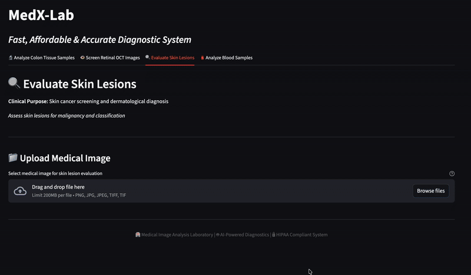

# 🏥 MedX-Lab: Accurate, Afforable & Fast Diagnostic Platform

---
## 🎥 Demo  
  

---
MedX-Lab is a **diagnostic platform** for diagnostic labs that allows you to upload medical specimens (images, scans, etc.) and instantly receive an AI-generated diagnosis with follow-up medical recommendations and connect to a doctor instantly.  

Traditionally, diagnosis and report preparation can take **days** — MedX-Lab reduces this to **minutes**.  
Doctors can quickly vet AI-prepared reports, accelerating clinical decision-making and patient care.  

⚡ Built with **Federated Learning** with **flower framework**:    
- AI is trained across multiple institutions without sharing sensitive data and having models tuned to population patterns
- Runs **locally**, ensuring reach, compliance and security.
- Doctors vetting are captured and used for retraining, ensuring high accuracy is maintained. 

Why it can have an **impact** ? 
Imagine you are in some rural part of the world, urgently needing testing for critical medical care but you need to travel to the city to get an accurate report for your disease or you need the report urgently but due to queue in diagnostic systems. Here this diagnostic platform can have an considerable impact by expanding the reach of medical systems and making it affordable. 

---

| Step                         | Human (Traditional) | AI (MedX-Lab) |
|------------------------------|----------------------|---------------|
| Specimen upload & pre-check    | 2–4 hours           | < 1 minute    |
| Initial classification       | 1–2 days            | < 5 minutes   |
| Report preparation           | 1 day               | < 2 minutes   |
| Doctor review & validation   | 1–2 hours           | ~1 hour (vetting only) |
| **Total Time**               | **2–4 days**        | **~10 minutes + doctor vetting** |

---


---
## ✨ Key Features
- 🤖 **Classification & Diagnosis** using trained deep learning models  
- 📝 **Instant Report Generation** powered by a **locally hosted LLM**  
- 🔒 **Privacy First**: Data never leaves your local system  
- ⚡ **Federated Learning** ensures robust, secure, and distributed training  

---

## 📊 Supported Analyses
- 🔬 **Tissue Pathology Analysis** (Colon biopsies)  
- 👁️ **Retinal Health Screening** (Diabetic retinopathy, glaucoma, etc.)  
- 🔍 **Skin Lesion Evaluation** (Cancerous vs non-cancerous lesions)  
- 🩸 **Blood Cell Analysis** (Blood count and differential analysis)  

---

## 🛠️ Installation & Usage
### 1️⃣ Clone the Repository
```bash
git clone https://github.com/kkkamur07/Flower-Decentralized-AI-Hackathon
cd medx-lab
```

### Install the dependencies
```bash
pip install -r requirements.txt
uv pip install . # to use pyproject.toml
```

### 3️⃣ Start Backend (API)

```bash
uvicorn medapp.service.api:app --host 0.0.0.0 --port 8000 --reload
```

### 4️⃣ Start Frontend (Streamlit)

```bash
streamlit run medapp/main.py
```

---

## 📄 Reports

- AI generates **HTML/PDF medical reports** with:
    
    - Primary findings & classification confidence

    - Clinical assessment (urgency, recommendations)
        
    - AI medical interpretation
        
    - Classification probabilities
        
These reports are sent to qualified doctors to be vetted by them. 

---

## ⚠️ Disclaimer

This tool is for **diagnostic support only**.  
All AI outputs **must be validated** by qualified medical professionals before clinical use.

---

## 📌 Tech Stack

- **Frontend**: Streamlit
    
- **Backend**: FastAPI + Uvicorn
    
- **AI Models**: Federated Learning Neural Networks
    
- **Visualization**: Plotly, Pandas
    
---

## 🔒 Privacy & Compliance

- Fully **HIPAA-compliant**
    
- Runs **locally** (no cloud dependency)
    
- Federated learning ensures **no raw data exchange**
    

---

## 🚀 Future Roadmap

- 🔗 Integration with hospital EMR systems
- 🧪 Multi-modal diagnostics (text + imaging)  
- 📱 Mobile-first deployment